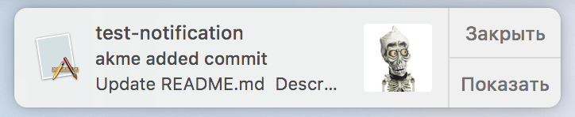

       
    

# GithubListener
Did you ever wanted to get notifications about new commits in repositories that you watch?  

GithubListener will show notifications about new commits to repositories that you [watch](https://github.com/watching) . 

## OAuth
To start getting notifications you need to grant access via Github OAuth, this is needed because of small ratelimit for unauthorized queries. You will be asked only once at first application start.
